- genericidad.java:
- ModeloPair.java

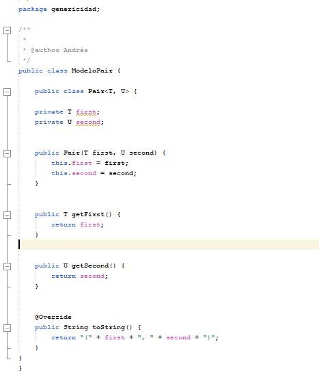

- ConexionGen.java

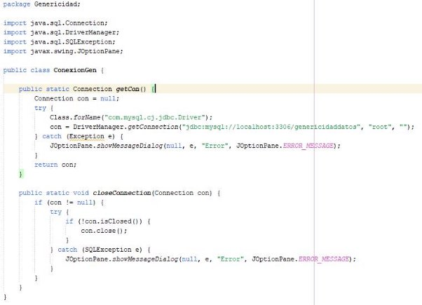

- Operaciondb.java

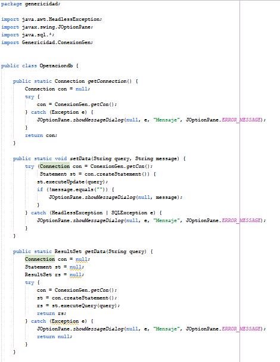

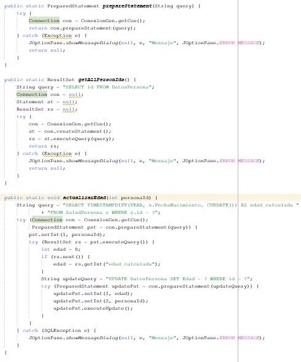

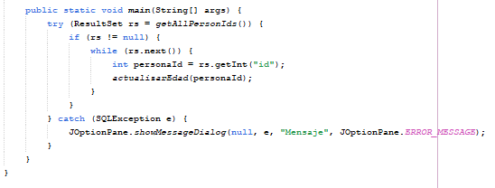

- TablasGen.java

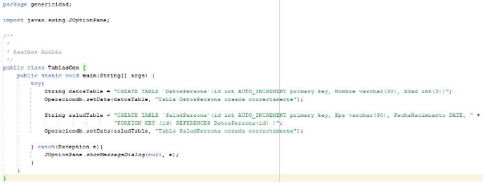

- AgregarPersona.java

- Funcionamiento:
- Persona a ingresar:

  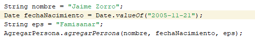

- Terminal:

  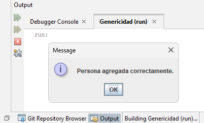

  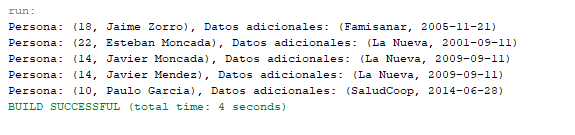

- Base de datos:

  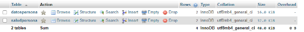

- datospersona:

  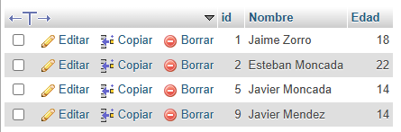

- saludpersona:

  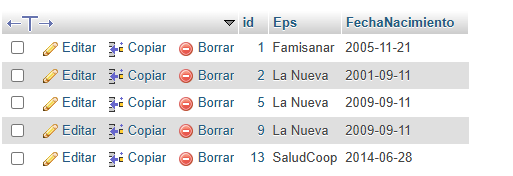
