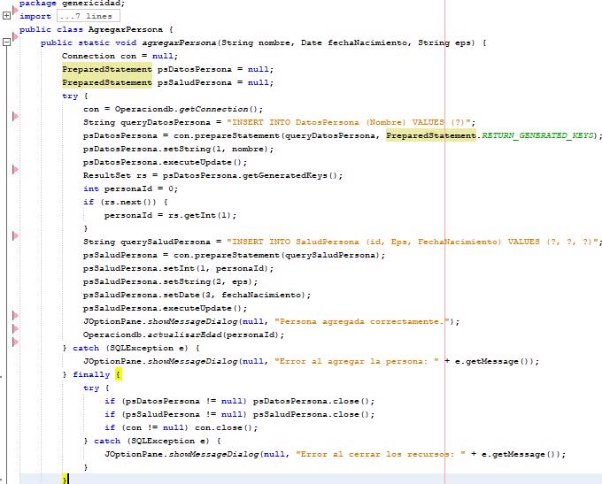

- genericidad.java:
- ModeloPair.java

- ConexionGen.java

- Operaciondb.java

- TablasGen.java

- AgregarPersona.java

- Funcionamiento:
- Persona a ingresar:

  

- Terminal:

  

  

- Base de datos:

  

- datospersona:

  

- saludpersona:

  
